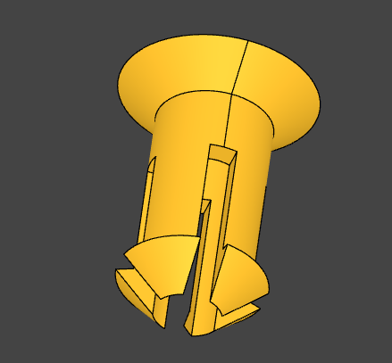
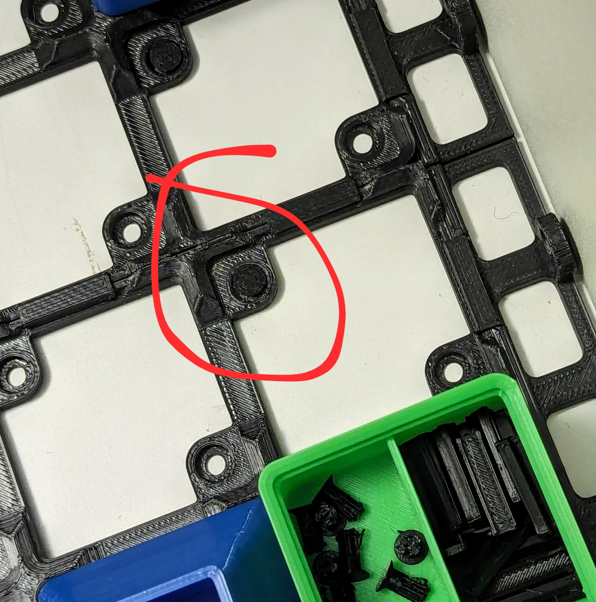

Paul's Gridfinity Things
========================

This Python program will generate several different kinds of gridfinity
compatible objects for 3D printing

Setup, You can install with pipx.

    sudo apt install pipx
    pipx install git+https://github.com/PaulBone/gfthings.git

If you want to modify gfthings then build it with poetry.

    sudo apt install pipx
    pipx install poetry
    poetry install

If you choose this option then you must prefix your commands with
`poetry run`

Copyright (C) Paul Bone
Distributed under: CC BY-NC-SA 4.0
https://creativecommons.org/licenses/by-nc-sa/4.0/

Bins
----

TODO.

Pins
----

Pins, or pegs, are a small object that can be used to attach a Gridfinity
base to a sheet of plywood such as found in the bottom of many desk drawers.
Run:

    gfpin

To generate pin.step.  Print it at a higher temperature if you can for
strong layer adheasion.  Pressing it through the gridfinity base and a 3mm
driled hole can take some force.  I don't know how easy it is to remove -
the question hasn't come up!

