Paul's Gridfinity Things
========================

This Python program will generate several different kinds of gridfinity
compatible objects for 3D printing.
Gridfinity is an open source storage system best introduced
[in this video](https://www.youtube.com/watch?v=ra_9zU-mnl8) and then this
[diagram](https://gridfinity.xyz/specification/).
Look on [thangs](thangs.com) and 
[printables](printables.com) for more compatible parts.

Install uv
----------

Linux / macOS:

    curl -LsSf https://astral.sh/uv/install.sh | sh

Windows (PowerShell):

    powershell -ExecutionPolicy ByPass -c "irm https://astral.sh/uv/install.ps1 | iex"

See [the uv install docs](https://docs.astral.sh/uv/getting-started/installation/)
for package-manager alternatives (Homebrew, winget, scoop, pipx, etc.).

Install gfthings as a CLI tool
------------------------------

Install gfthings into an isolated, uv-managed environment and put its
commands (`gfbin`, `gfbase`, `gfedge`, `gfpin`) on your `PATH`:

    uv tool install gfthings

Upgrade or remove later with:

    uv tool upgrade gfthings
    uv tool uninstall gfthings

Run without installing (uvx)
----------------------------

`uvx` runs a tool in a one-shot, ephemeral environment — handy for trying
things out or for CI:

    uvx --from gfthings gfbin -h
    uvx --from gfthings gfbin -x 2 -y 3 -o bin.step
    uvx --from gfthings gfbase -x 4 -y 3 -o base.step

The `--from gfthings` is required because the command names (`gfbin`,
etc.) don't match the package name.

Recipe scripts (gfbin.sh / .ps1, gfbase.sh / .ps1, gfedge.sh / .ps1, gfpin.sh / .ps1)
-------------------------------------------------------------------------------------

For day-to-day printing it's awkward to remember the exact CLI flags
that produced a particular part. The repo ships a pair of *recipe*
launcher scripts for every tool — one Bash version (`*.sh`, for Linux
and macOS) and one PowerShell version (`*.ps1`, for Windows) — that
each declare the parameters as variables at the top, auto-derive the
output filename from those variables, and then call `uvx --from <git
URL> <tool>` for you.

Workflow:

1. Copy the recipe for the tool you want, renaming it to whatever
   describes the part — e.g.

       cp gfbin.sh   screws-bin-2x2x4.sh        # Linux / macOS
       Copy-Item gfbin.ps1 .\screws-bin-2x2x4.ps1   # Windows

2. Edit the variables at the top (dimensions, scoop, magnet flags,
   output format, etc.) to taste.

3. Run it:

       ./screws-bin-2x2x4.sh                   # Linux / macOS
       .\screws-bin-2x2x4.ps1                  # Windows

The script prints the equivalent `uvx ... gfbin ...` invocation it's
about to run, then writes a `.step` (or `.stl`) file next to the
script. The filename is built from the parameters — toggling
`NoMagnet=true` adds `_nomagnet` to the name, switching to `Format=stl`
flips the extension, etc. — so the same recipe always regenerates the
same file, and small tweaks produce uniquely-named siblings without
clobbering anything.

The Bash and PowerShell versions take exactly the same variables, so
recipes are portable: a `.sh` and `.ps1` with the same values produce
identical CAD output. Both pin `GfthingsSource` to the
`bitranox/gfthings@py314compat` branch so 3.13 / 3.14 users get the
upstream `build123d` `dev` branch automatically (see the Python 3.13 /
3.14 note below); change that line if you want to track a different
fork or branch.

Tools covered: `gfbin` (bins), `gfbase` (bases), `gfedge` (drawer-edge
fillers), `gfpin` (the small attaching pin).

Develop gfthings
----------------

Clone the repo and let uv manage the environment:

    uv sync                 # creates .venv and installs deps + project
    uv add ocp-vscode       # optional: add a dependency
    uv run gfbin -h         # run a script from the project

`uv sync` also picks up the `test` dependency group; run the suite with:

    uv run --group test pytest

Python 3.13 / 3.14 note: the released `build123d` on PyPI (0.10.0)
transitively pulls `vtk`, which has no Python 3.13 or 3.14 wheels, so a
plain install fails on those interpreters. On 3.13 and 3.14 this project
resolves `build123d` from its upstream `dev` branch (which depends on
`cadquery-ocp-novtk` and skips the `vtk` dependency entirely) via a
marker-conditional `[tool.uv.sources]` entry — `uv sync`, `uv tool
install`, and `uvx --from .` all work from a checkout. On 3.10–3.12 the
regular PyPI release is used.

The `[tool.uv.sources]` block is uv-specific metadata and is not baked
into a built wheel, so the project remains publishable to PyPI. Plain
`pip install gfthings` on 3.13 / 3.14 will still fail (pip ignores
`[tool.uv.sources]` and tries to resolve the released wheel, which then
hits the missing `vtk` wheels) until upstream `build123d` ships a release
that also targets 3.13+ — `uv` is the supported install path on those
versions for now.

Copyright (C) Paul Bone
Distributed under: CC BY-NC-SA 4.0
https://creativecommons.org/licenses/by-nc-sa/4.0/

Bins
----

Bins are gridfinity bins.  They are inspired by
[Pred's bins](https://www.printables.com/model/592545-gridfinity-bin-with-printable-label-by-pred-parame)
and include the same label shelf.
They are easy to print (overhangs and bridges are minimised) and can be
generated in a number of custom sizes with and without dividers.  For more
information see:

    gfbin -h

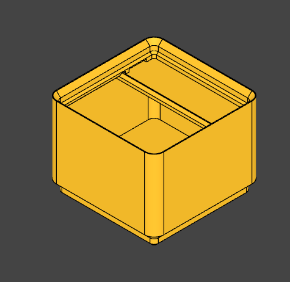
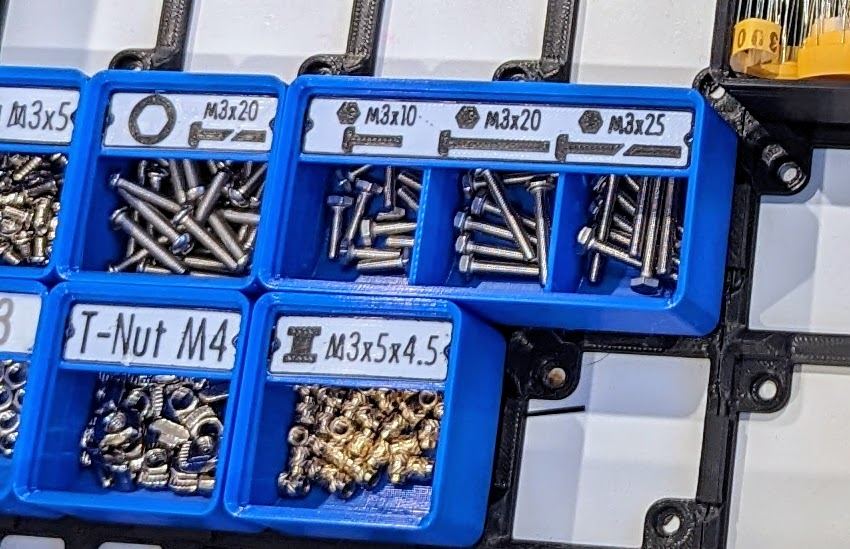

Features
--------

The bins have a label shelf, of course you could use a label maker and stick
on a lable.
Or 3D print a label with Nick's excellent
[gflabel](https://github.com/ndevenish/gflabel) program and choose pred
style labels.

Maybe you can just tell what's in your bins and don't need a label.  That's
what the `--no-label` option is for!

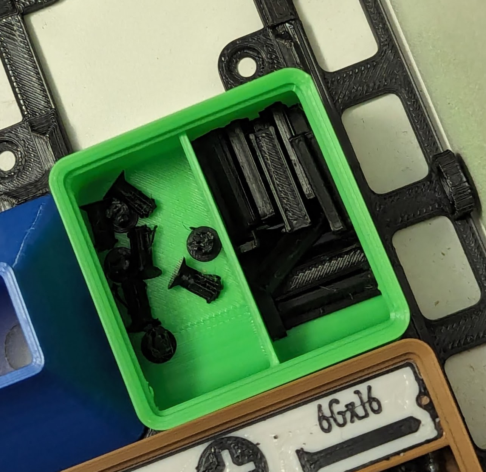

Ooh, that bin has a dividor.  To add dividors use the -d option.  Giving a 2
will make 2 compartments (1 partition).  The above bin was made with:

    gfbin --no-label -d 2 -s 10

The -s is for scoop radius.  A little scoop in the front of the bin will
help you get small parts out.  This one has a 10mm radius, the default is
12.5mm.  Use -s 0 for no scoop at the front at all, eg if you want to store
larger items.

If something you're storing is a tight fit try removing the stacking lip,
and if it's still a tight fit, you can probably take 0.4mm off each wall:

    gfbin --no-label -s 0 --no-lip --wall-thickness 0.8

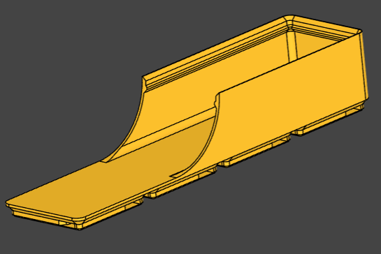

What if you want to store chopsticks, but your chopsticks are longer than
your printer bed.  Print two bins with some of the walls removed
(--half-wall) and place them next to each -other.  The scope gives a
convenient place to put your hand to pick up the chopsticks.  Scoops and
labels are not supported on half-wall bins.

    gfbin -x 1 -y 4 --half-wall

Magnet holes
------------

Bins are generated with
[Gridfinity Refined](https://www.printables.com/model/413761-gridfinity-refined)
style magnet holes.  These are press fit magnet holes that allow you to
insert a magnet from the side.

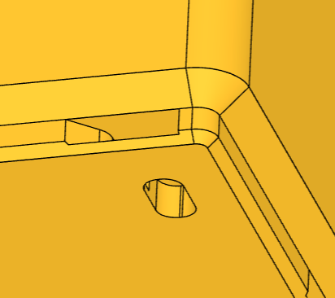

Use the blade of a flat-head screwdriver to push the magnet in.  No worries
if you put it the wrong way around and need to take it out.  You can get a
thin pin or alen key into the gap on the bottom of the bin to push it back
out.

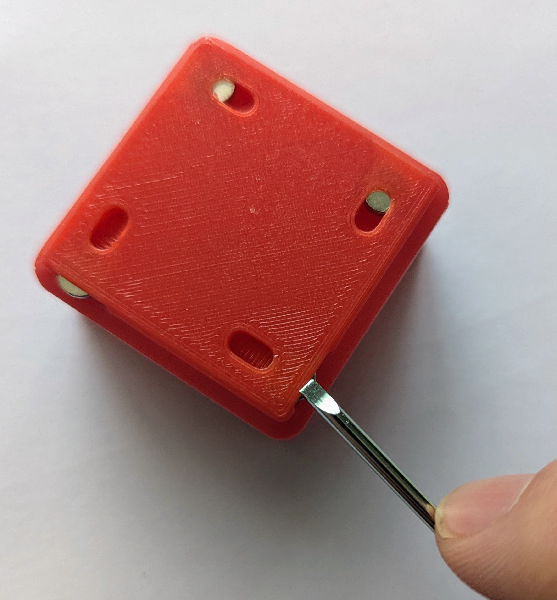

By default this fits 6x2 magnets, but maybe you've got some 8x3 magnets left
over from another project?

    gfbin --magnet-dia 8 --magnet-height 3

Or maybe you don't want "gridfinity refined" style magnet holes.  Try
`--unrefined`.

Sizes
-----

You can make bins of any size, units are specified in "gridfinity units",
that's 42mm across and back-to-front. Up and down is 7mm per unit
plus the base.

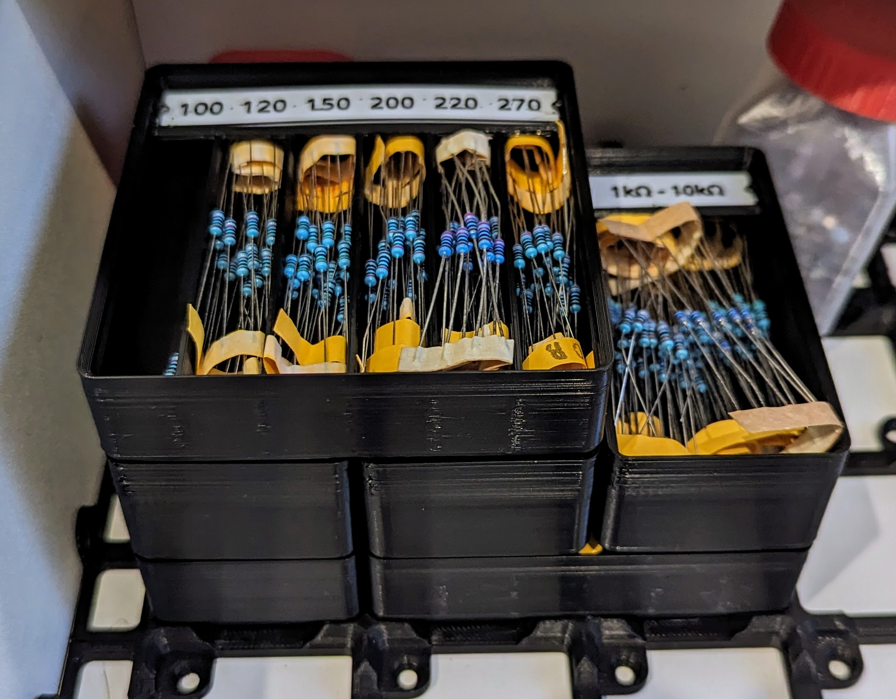

The two bins on top of this stack are generated with 

    gfbin -x 2 -y 2 -z 3 -d 6 -s 0
    gfbin -x 1 -y 2 -z 4 -s 0

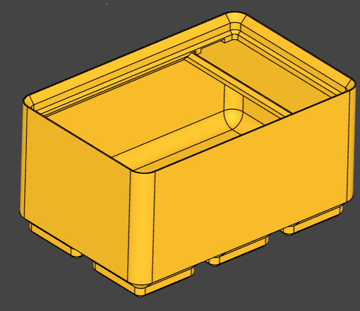

Whole numbers aren't flexible enough.  Try .5 numbers.  This bin is
1 unit wide, and 1.5 deep.  This works provided its base profile can be half
the size, it is generated with:

    gfbin -x 1 -y 1.5 --half-grid

Of course you can use a half grid base with whole number bin sizes, but not
the other way around.  Also half-grids don't support magnet holes.

Checkout reminders for these options and more with

    gfbin -h

Funky bins
----------

I had a tool that has an L shape, storing it in a rectangle bin would be a waste.  So I created funky bins.  They're specified by providing a 2D list of bools that specify is that square is part of the bin or not.

    gfbin --funky \
        "[[True, False], [[True, False], [True, False],[True, True]]" \
        -z 14

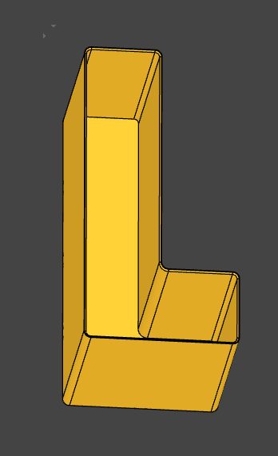

The minor lists must all have the same length, and generating bins in this way has a finer stacking lip than when the regular `-x` and `-y` arguments are used (currently a build123d limitation).

L-shaped bins are possibly the most useful, but there are many possibilities.  Some "special" arguments for `--funky` refer to presets that may be fun, try:

    gfbin --funky donut -z 4 -o donut.step

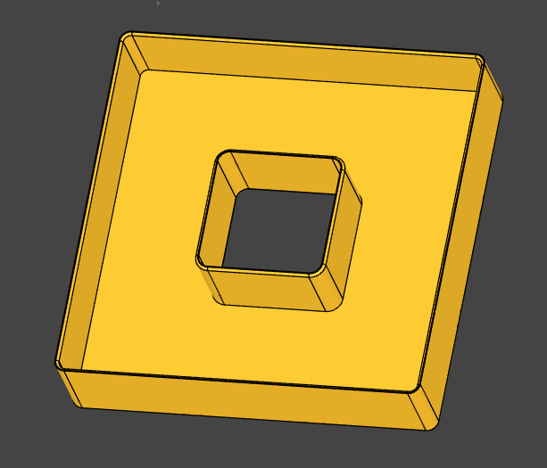

Maybe this would be a suitable box for coiled USB cables, then place a 1x1 bin in the centre for USB A-to-C adaptors.

The available presets are:

 * donut
 * cross
 * tetris_l
 * tetris_j
 * tetris_t
 * tetris_s
 * tetris_z

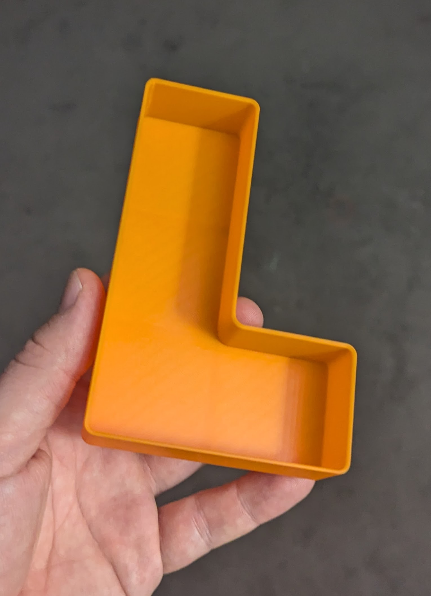

Now packing your storage away can really be like tetris.  Just don't completely fill a row!

Bases
-----

A minimal gridfinity base.  This is a remix of
https://www.printables.com/model/608500-gridfinity-base-light-magnetic-connectable-paramet
with paramertised dimensions.  Try:

    gfbase -h
    gfbase -x 4 -y 3 -o base.step

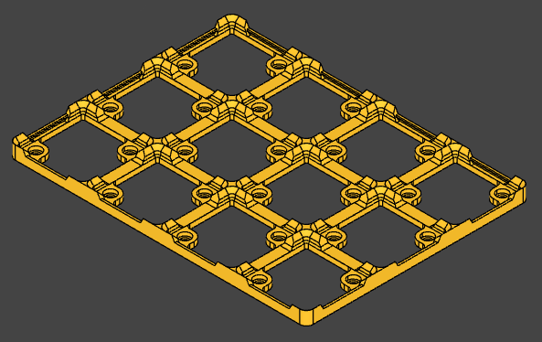

To connect bases made with gfbase use the clips found
[https://www.printables.com/model/608500-gridfinity-base-light-magnetic-connectable-paramet/files](on the original model).
Mulitple bases can be connected to fill the bottom of a drawer.
For example this drawer has two 4x3 and two 4x4 bases connected.  It also
has some edge pieces (comming soon) that prevent the base from sliding
around.

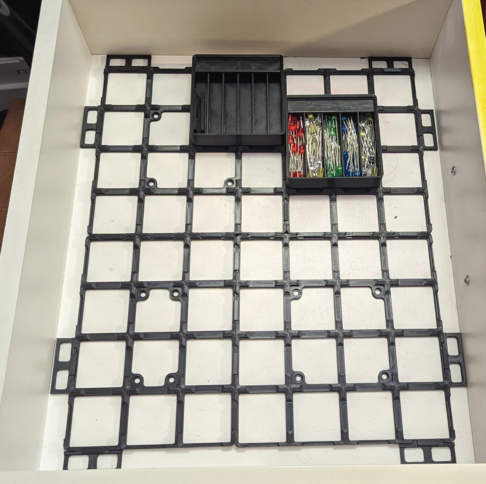

You can customise the screw holes, By default counterbored holes that can
take a magnet, screw or pin (below) are generated.  you can change the screw
diameter, magnet diameter and magnet depth.

    gfbase --magnet-diameter 6.1 \
           --screw-diameter 4 \
           --magnet-depth 2

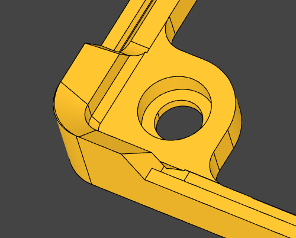

By default there are two screw/magnet holes per square.  But to save plastic
or printing time generate a minimal baseplate with

    --screw-hole-count 0

Other valid options are 2 and 4.

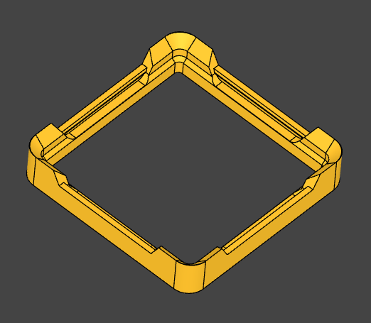
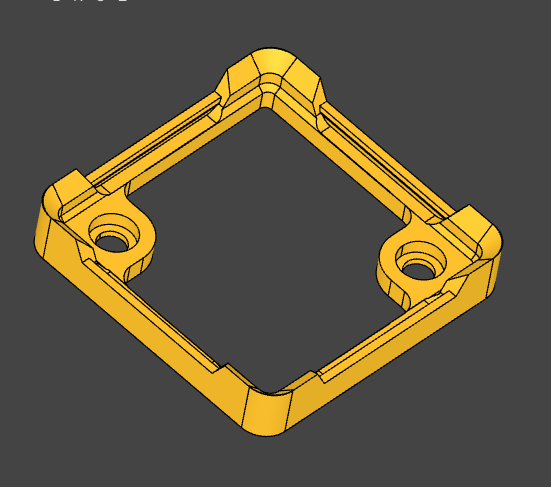
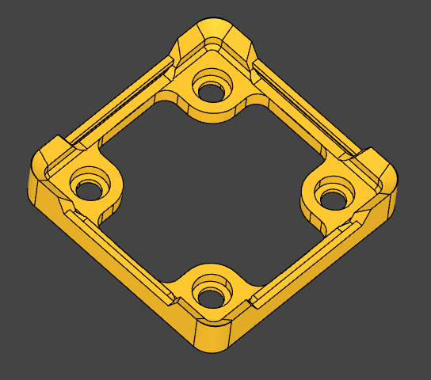

Finally there's a "screw hole pattern for drawers" option:

    --screw-hole-pattern-drawer

This places exactly 4 screw holes in the corners but not-too-near the
corners (clearance for my drill).  Which is suitable if you need to mount
the base but don't need to provide magnets or iron screws for magnets in the
boxes.

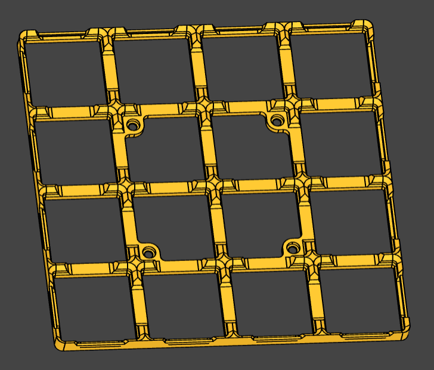

If you don't need any screw holes then the base can be made shorter to save time, filament and height.

    --short

Base Edges
----------

I don't know about you but my drawers arn't multiples of 42mm and I don't want the bases sliding around in the drawers.  So I've added another program that creates "edge spaces" to fill up room and stop be base from slopping around.

    gfedge -x 4 -y 14 -o edge.step

Like before the -x parameter is in gridfinity units.  But the -y parameter is not!  It's in milimetres.

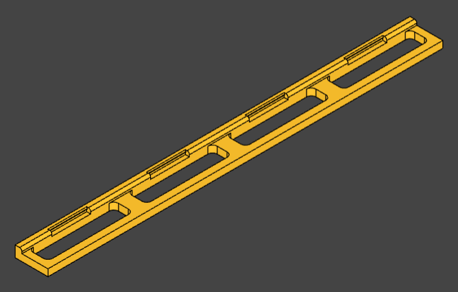

Short variations of the edges to match the short base can be made with the --short option

    gfedge --short -x 4 -y 10 -o edge.step

Pins
----

Pins, or pegs, are a small object that can be used to attach a Gridfinity
base to a sheet of plywood such as found in the bottom of many desk drawers.
Run:

    gfpin

To generate pin.step.  Print it at a higher temperature if you can for
strong layer adheasion.  Pressing it through the gridfinity base and a 3mm
driled hole can take some force.  I don't know how easy it is to remove -
the question hasn't come up!

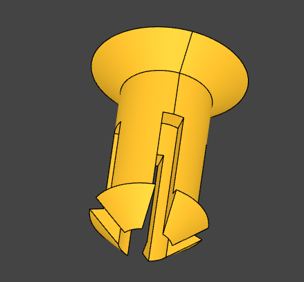
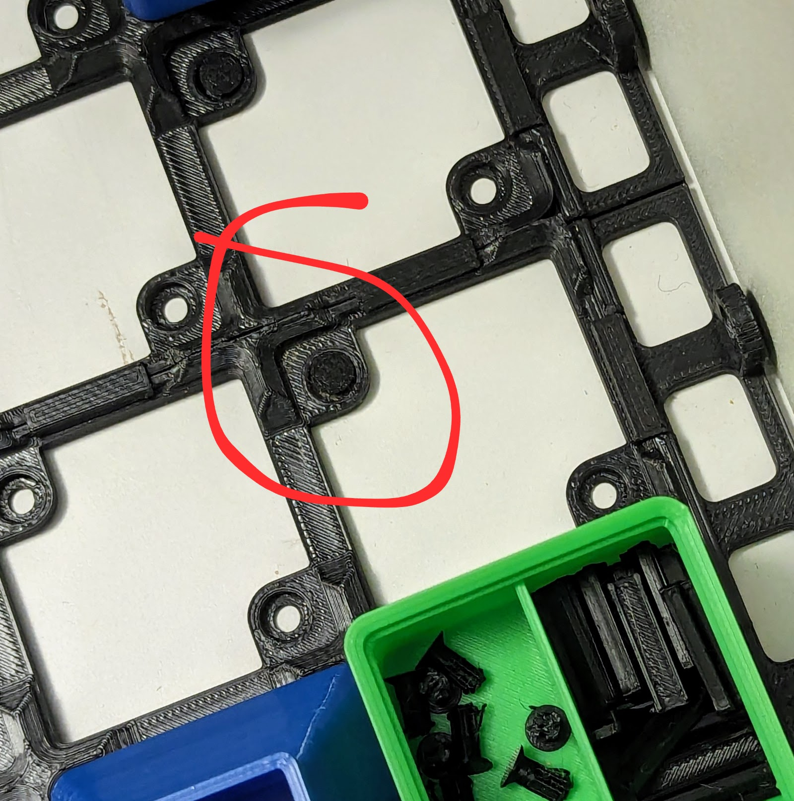

Links
-----

 * Pypi package: https://pypi.org/project/gfthings/
 * gfbin on Printables: https://www.printables.com/model/1132524-pauls-gridfinity-bins
 * gfbase on Printables: https://www.printables.com/model/907320-gridfinity-base-light-connectable-parametric-79-va
 * gfpin on Printables: https://www.printables.com/model/883473-pinpeg-for-securing-to-plywood

