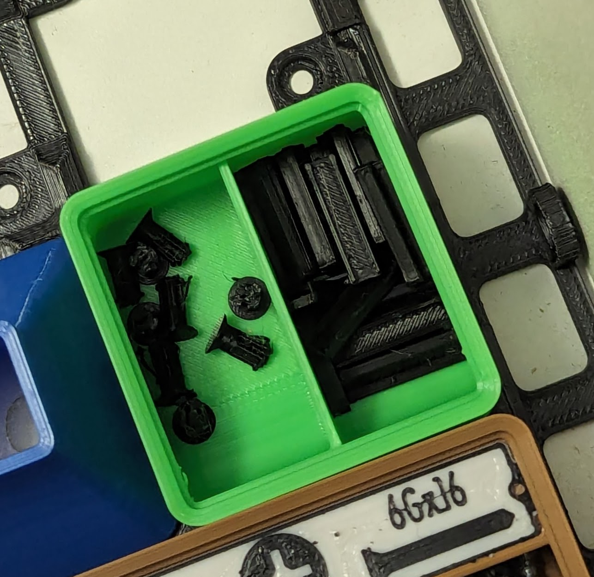
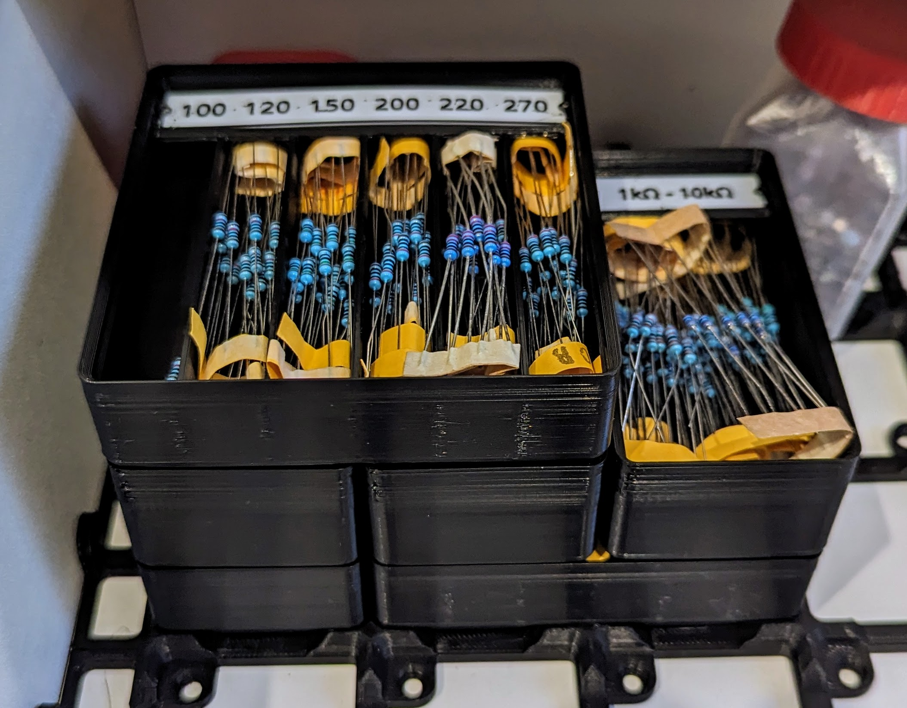
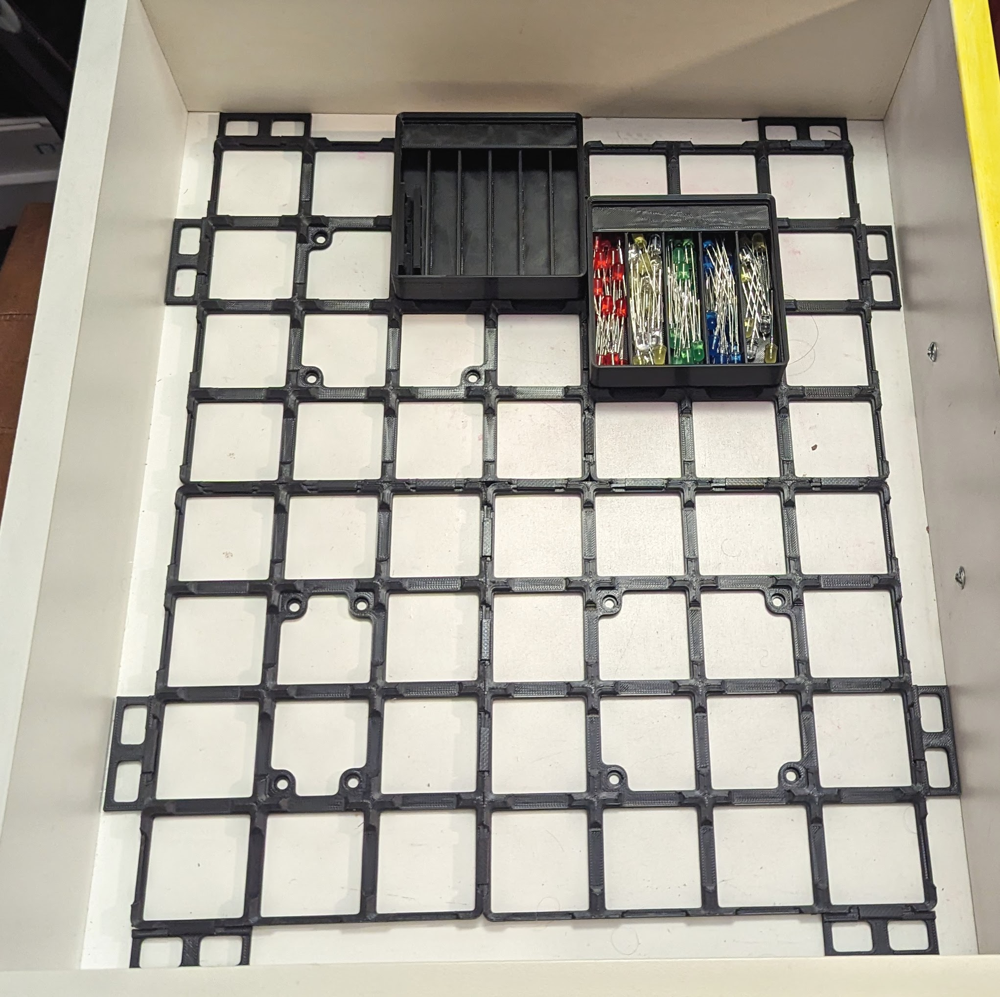
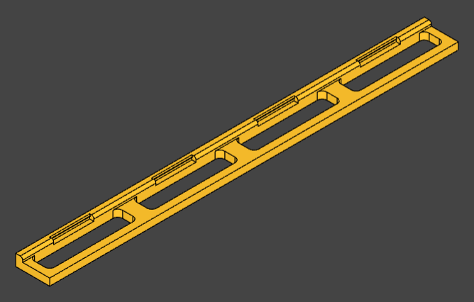

Paul's Gridfinity Things
========================

This Python program will generate several different kinds of gridfinity
compatible objects for 3D printing.
Gridfinity is an open source storage system best introduced
[in this video](https://www.youtube.com/watch?v=ra_9zU-mnl8) and then this
[diagram](https://gridfinity.xyz/specification/).
Look on [thangs](thangs.com) and 
[printables](printables.com) for more compatible parts.

Setup, You can install with pipx.

    sudo apt install pipx
    pipx install gfthings

If you want to modify gfthings then build it with poetry.

    sudo apt install pipx
    pipx install poetry
    poetry add ocp-vscode
    poetry install

If you choose this option then you must prefix your commands with
`poetry run`

Copyright (C) Paul Bone
Distributed under: CC BY-NC-SA 4.0
https://creativecommons.org/licenses/by-nc-sa/4.0/

Bins
----

Bins are gridfinity bins.  They are inspired by
[Pred's bins](https://www.printables.com/model/592545-gridfinity-bin-with-printable-label-by-pred-parame)
and include the same label shelf.
They are easy to print (overhangs and bridges are minimised) and can be
generated in a mumber of custom sizes with and without dividers.  For more
information see:

    gfbin -h

The bins have a label shelf, of course you could use a label maker and stick
on a lable.
Or 3D print a label with Nick's excellent
[gflabel](https://github.com/ndevenish/gflabel) program and choose pred
style labels.

Maybe you can just tell what's in your bins and don't need a label.  That's
what the `--no-label` option is for!

Ooh, that bin has a dividor.  To add dividors use the -d option.  Giving a 2
will make 2 compartments (1 partition).  The above bin was made with:

    gfbin --no-label -d 2 -s 10

The -s is for scoop radius.  A little scoop in the front of the bin will
help you get small parts out.  This one has a 10mm radius, the default is
12.5mm.  Use -s 0 for no scoop at the front at all, eg if you want to store
larger items.

You can make bins of any size, units are specified in "gridfinity units",
that's 42mm across and back-to-front. Up and down is 7mm per unit
plus the base.

The two bins on top of this stack are generated with 

    gfbin -x 2 -y 2 -z 3 -d 6 -s 0
    gfbin -x 1 -y 2 -z 4 -s 0

Checkout reminders for these options and more with

    gfbin -h

Bases
-----

A minimal gridfinity base.  This is a remix of
https://www.printables.com/model/608500-gridfinity-base-light-magnetic-connectable-paramet
with paramertised dimensions.  Try:

    gfbase -h
    gfbase -x 4 -y 3 -o base.step

To connect bases made with gfbase use the clips found
[https://www.printables.com/model/608500-gridfinity-base-light-magnetic-connectable-paramet/files](on the original model).
Mulitple bases can be connected to fill the bottom of a drawer.
For example this drawer has two 4x3 and two 4x4 bases connected.  It also
has some edge pieces (comming soon) that prevent the base from sliding
around.

You can customise the screw holes, By default counterbored holes that can
take a magnet, screw or pin (below) are generated.  you can change the screw
diameter, magnet diameter and magnet depth.

    gfbase --magnet-diameter 6.1 \
           --screw-diameter 4 \
           --magnet-depth 2

By default there are two screw/magnet holes per square.  But to save plastic
or printing time generate a minimal baseplate with

    --screw-hole-count 0

Other valid options are 2 and 4.

Finally there's a "screw hole pattern for drawers" option:

    --screw-hole-pattern-drawer

This places exactly 4 screw holes in the corners but not-too-near the
corners (clearance for my drill).  Which is suitable if you need to mount
the base but don't need to provide magnets or iron screws for magnets in the
boxes.

Base Edges
----------

I don't know about you but my drawers arn't multiples of 42mm and I don't want the bases sliding around in the drawers.  So I've added another program that creates "edge spaces" to fill up room and stop be base from slopping around.

    gfedge -x 4 -y 14 -o edge.step

Like before the -x parameter is in gridfinity units.  But the -y parameter is not!  It's in milimetres.

Pins
----

Pins, or pegs, are a small object that can be used to attach a Gridfinity
base to a sheet of plywood such as found in the bottom of many desk drawers.
Run:

    gfpin

To generate pin.step.  Print it at a higher temperature if you can for
strong layer adheasion.  Pressing it through the gridfinity base and a 3mm
driled hole can take some force.  I don't know how easy it is to remove -
the question hasn't come up!

Links
-----

 * Pypi package: https://pypi.org/project/gfthings/
 * gfbase on Printables: https://www.printables.com/model/907320-gridfinity-base-light-connectable-parametric-79-va
 * gfpin on Printables: https://www.printables.com/model/883473-pinpeg-for-securing-to-plywood

